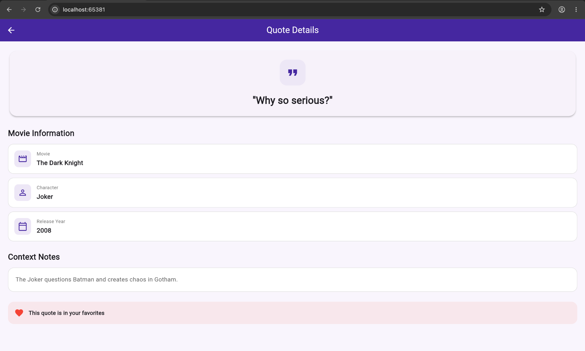
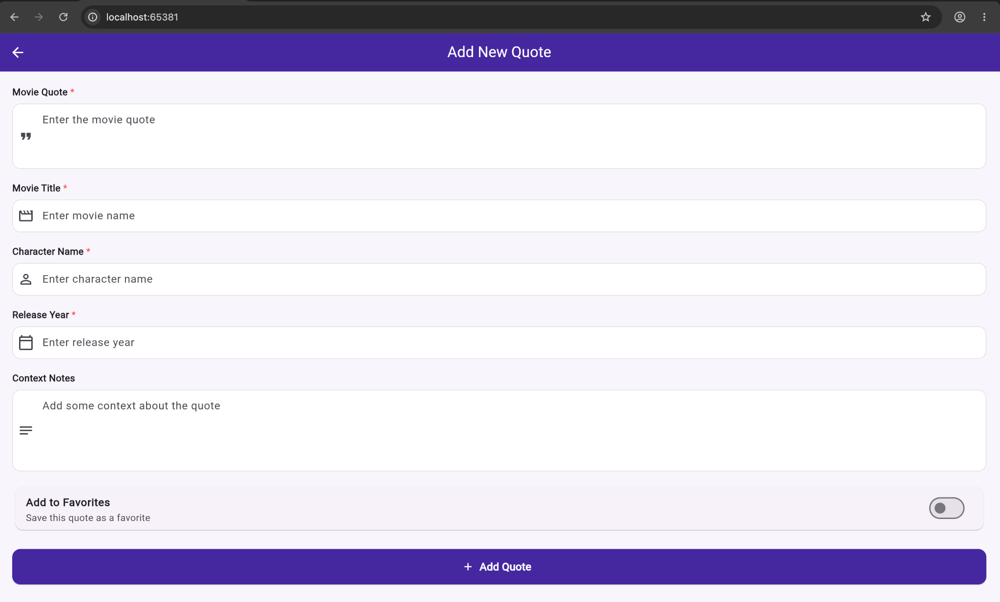
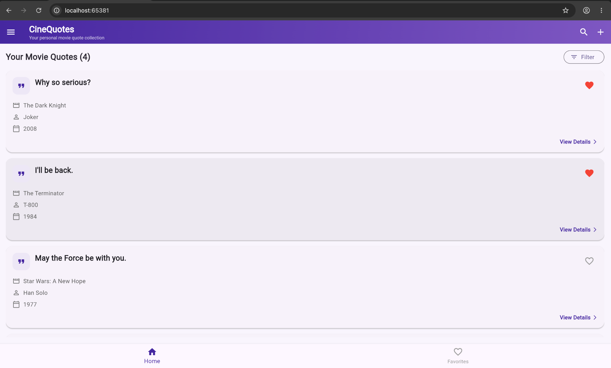

# 🎬 CineQuotes

> A Flutter mobile application for collecting, organizing, and managing memorable movie quotes.

CineQuotes provides a simple and clean interface where users can save their favorite movie quotes along with movie information, character details, release year, and context notes.

## ✨ Features

- 🎬 View a collection of movie quotes
- ➕ Add new movie quotes
- ❤️ Mark quotes as favorites
- 📖 View detailed quote information
- 📝 Add context notes for each quote
- 🎭 Store movie and character information
- 📅 Store movie release year
- 🔎 Search and filter interface
- 📱 Responsive Flutter UI

## 📱 Screenshots

### 🏠 Home Screen



The home screen displays the saved movie quotes with movie, character, release year, and favorite status.

### ➕ Add New Quote



Users can add a quote by entering the movie quote, movie title, character name, release year, and context notes. A quote can also be added directly to favorites.

### 📖 Quote Details



The details screen presents the complete quote along with movie information, character, release year, context notes, and favorite status.

## 🛠️ Technologies Used

- **Flutter** — Mobile application framework
- **Dart** — Programming language
- **Material 3** — UI design system
- **Android / iOS / Web** — Flutter-supported platforms

## 📂 Project Structure

```text
lib/
├── main.dart
├── home_screen.dart
├── add_quote_screen.dart
├── favorites_screen.dart
└── quote_detail_screen.dart
```

### Main Files

| File | Purpose |
|---|---|
| `main.dart` | Starts the CineQuotes application and defines the app theme. |
| `home_screen.dart` | Displays quotes, favorite controls, navigation, and quote cards. |
| `add_quote_screen.dart` | Provides the form for creating a new quote. |
| `favorites_screen.dart` | Displays quotes marked as favorites. |
| `quote_detail_screen.dart` | Shows complete information about a selected quote. |

## 🚀 Getting Started

### 1. Clone the repository

```bash
git clone https://github.com/Nupurbhoir/cinequotes-flutter.git
```

### 2. Open the project

```bash
cd cinequotes-flutter
```

### 3. Get Flutter dependencies

```bash
flutter pub get
```

### 4. Run the application

```bash
flutter run
```

For Chrome:

```bash
flutter run -d chrome
```

## 💡 How CineQuotes Works

1. The user opens the Home screen and views saved movie quotes.
2. The user can tap a quote to open its detailed information.
3. The user can use the **Add Quote** option to create a new quote.
4. Required quote information is validated before saving.
5. The user can mark a quote as a favorite using the ❤️ heart icon.
6. Favorite quotes are available from the **Favorites** section.

## 📝 Current Data Storage

The current version stores quote data **in memory** while the application is running. No external database or backend is currently connected.

## 🎯 Future Enhancements

- 🔍 Functional search
- 🏷️ Advanced quote filtering
- 💾 Local database storage
- ☁️ Cloud synchronization
- ✏️ Edit and delete quotes
- 📤 Share favorite quotes

## 👩‍💻 Author

**Nupur Bhoir**

Flutter Development Project — CineQuotes

---

⭐ If you like this project, consider giving the repository a star!
